<div align="center">
  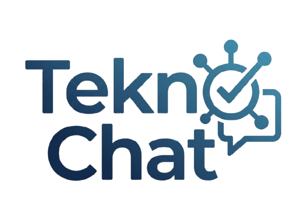

  <h1>TeknoChat — TEKNOFEST Yarışmacı Asistanı</h1>

  <p>
    Doğrulanmış şartname, kılavuz ve SSS kaynaklarına dayanan, kaynak gösteren ve
    kanıtı yetersiz olduğunda insana yönlendiren bir RAG (Retrieval-Augmented Generation)
    destekli soru-cevap asistanı.
  </p>

  <p>
    <strong>T3 Vakfı Yapay Zekâ Creathonu · Problem 5</strong>
  </p>
</div>

---

## İçindekiler

- [Proje Hakkında](#proje-hakkında)
- [Canlı Demo](#canlı-demo)
- [MVP Gereksinimleri](#mvp-gereksinimleri)
- [Kullanıcı Rolleri](#kullanıcı-rolleri)
- [Temel Akışlar](#temel-akışlar)
- [Ekran Görüntüleri](#ekran-görüntüleri)
- [Mimari](#mimari)
- [Teknoloji Yığını](#teknoloji-yığını)
- [Güvenlik](#güvenlik)
- [Ekip](#ekip)
- [Yerel Kurulum](#yerel-kurulum)
- [Dağıtım (Deployment)](#dağıtım-deployment)

---

## Proje Hakkında

TeknoChat, TEKNOFEST yarışmacılarının şartname, kılavuz ve sık sorulan sorular gibi
kaynaklarda kaybolmadan hızlıca doğru bilgiye ulaşmasını sağlamak için geliştirilmiş bir
yapay zeka destekli asistandır. Sistem, sorulan soruları **yalnızca doğrulanmış ve güncel
kaynaklara dayanarak** yanıtlar; yeterli kanıt bulunamayan durumlarda yanıt uydurmak
yerine soruyu doğrudan Destek Ekibi'ne yönlendirir.

Platform dört farklı role hizmet verir: sorularını soran **Yarışmacılar**, kaynak havuzunu
güncel tutan **İçerik Yöneticileri**, insana yönlenen soruları çözen **Destek Ekibi** ve
sistemi izleyen **Sistem Yöneticileri**.

### RAG'in üç katmanlı yedekleme zinciri

Sistem, yanıt üretimi için sırayla denenen üç farklı katmana sahiptir ve hangisinin
kullanıldığını her zaman kullanıcıya açıkça gösterir; bir katman başarısız olursa
kullanıcı fark etmeden bir sonrakine geçilir, hizmet hiçbir zaman tamamen durmaz:

1. **Yapay Zeka Yanıtı (Ollama)** — Yerel bir Ollama sunucusu (qwen2.5:7b + bge-m3 embedding)
   üzerinden tam RAG boru hattı: soru embedlenir, en alakalı kaynak parçaları bulunur, model
   bu parçalara dayanarak doğal dilde, kaynaklı bir yanıt üretir (SignalR ile canlı akış olarak).
2. **Claude Bulut Yanıtı** — Ollama'ya erişilemediğinde devreye giren, Anthropic Claude API
   üzerinden çalışan bulut tabanlı ikinci RAG katmanı; aynı kaynak parçalarını kullanarak
   aynı şekilde kaynaklı, akan bir yanıt üretir. Kullanıcıya bu yanıtın bulut yapay zeka ile
   üretildiği ayrıca belirtilir.
3. **Temel Arama Modu** — Hem Ollama hem Claude'a erişilemediğinde devreye giren, dış
   bağımlılığı olmayan anahtar kelime tabanlı bir yedek mod. Yanıt yine doğrulanmış
   kaynaklardan gelir, sadece üretim yerine doğrudan alıntı kullanılır.

Panelin kenar çubuğunda, her üç katmanın o an canlı/erişilebilir olup olmadığını gösteren
küçük durum noktaları bulunur. Gereksiz yapay zeka trafiği oluşturmamak için bu durumlar
agresif şekilde canlı yoklanmaz — sonuçlar önbelleğe alınır (Ollama 60 sn, Claude 5 dk) ve
gerçek sohbet isteklerinin sonucundan da güncellenir.

## Canlı Demo

| | |
|---|---|
| **Uygulama** | [teknochat.tryasp.net](https://teknochat.tryasp.net) |
| **API** | [technochatapi.runasp.net](https://technochatapi.runasp.net) |

> Not: Ana yapay zeka yanıt üretimi, demo sırasında yerel bir bilgisayarda çalışan Ollama
> sunucusuna bağlıdır. O sunucu kapalıyken sistem otomatik olarak Claude bulut katmanına,
> o da erişilemezse Temel Arama Modu'na geçer — hizmet hiçbir durumda kesintiye uğramaz,
> sadece yanıt üretim biçimi değişir.

## MVP Gereksinimleri

Problem 5 tanımındaki altı zorunlu gereksinimin tamamı karşılanmıştır:

- [x] **Doğrulanmış kaynak havuzu** — Şartname, kılavuz ve onaylı SSS belgeleri yüklenir; kaynak adı ve geçerlilik tarihi (`ValidFrom` / `ValidUntil`) tutulur.
- [x] **RAG tabanlı doğal dil soru-cevap** — Serbest ifadeli sorular, ilgili kaynak parçaları bulunarak yanıtlanır.
- [x] **Kaynak gösterimi ve güven seviyesi** — Her yanıt hangi belge(ler)e dayandığını ve bir güven seviyesi (Yetersiz / Düşük / Orta / Yüksek) gösterir.
- [x] **Kanıt yetersizse kesin yanıt verilmez** — Güven seviyesi eşiğin altındaysa yanıt uydurulmaz, soru doğrudan Destek Ekibi'ne yönlendirilir.
- [x] **Yarışma / kategori bağlamı** — Kullanıcı ilgili yarışmayı (ve isteğe bağlı kategoriyi) seçer; arama yalnızca o bağlamdaki aktif kaynaklarda yapılır.
- [x] **Dört kullanıcı rolü** — Yarışmacı, İçerik Yöneticisi, Destek Ekibi, Sistem Yöneticisi; her biri rolüne özel ekranlara ve API yetkilerine sahiptir.

## Kullanıcı Rolleri

| Rol | Sorumluluk |
|---|---|
| **01 · Yarışmacı** | Sorularını doğal dille iletir; doğrulanmış şartname ve kılavuzlara dayalı kaynaklı yanıt alır, gerekirse destek talebi oluşur. |
| **02 · İçerik Yöneticisi** | Güncel şartname, kılavuz ve onaylı SSS kaynaklarını sisteme ekler, yarışma/kategori tanımlar ve kaynakların geçerliliğini yönetir. |
| **03 · Destek Ekibi** | Asistanın yanıtlayamadığı veya insan müdahalesi gereken soruları devralır, yanıtlar ve tekrarlayan konuları tek tıkla SSS havuzuna ekler. |
| **04 · Sistem Yöneticisi** | Yanıt kalitesini, insana yönlendirme oranını ve sık sorulan konuları izleyerek sistemi iyileştirir; kullanıcı hesaplarını yönetir. |

## Temel Akışlar

**Akış 01 — Yarışmacı:** Yarışmasını seçer → sorusunu doğal dille yazar → kaynaklı yanıtı görür → yeterli kanıt yoksa otomatik olarak destek talebi oluşturulur.

**Akış 02 — İçerik Yöneticisi:** Yeni şartnameyi yükler (PDF/DOCX/TXT) → eski kaynağı pasife alır → bilgi havuzu güncellenir, eski sürüm artık aramada kullanılmaz.

**Akış 03 — Destek Ekibi:** İnsana yönlenen soruları görür → yanıtlar → "Aynı zamanda SSS'e ekle" seçeneğiyle tekrarlayan konuyu tek tıkla SSS havuzuna ekler, böylece bir sonraki benzer soru doğrudan yapay zeka tarafından yanıtlanabilir hale gelir.

**Akış 04 — Sistem Yöneticisi:** Toplam soru sayısı, yönlendirme oranı, güven seviyesi dağılımı ve sık sorulan konuları izler; kullanıcı hesaplarını yönetir.

## Ekran Görüntüleri

### Herkese Açık Sayfalar

| Anasayfa | Hakkında |
|---|---|
| 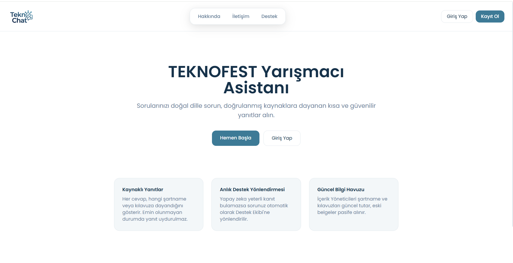 | 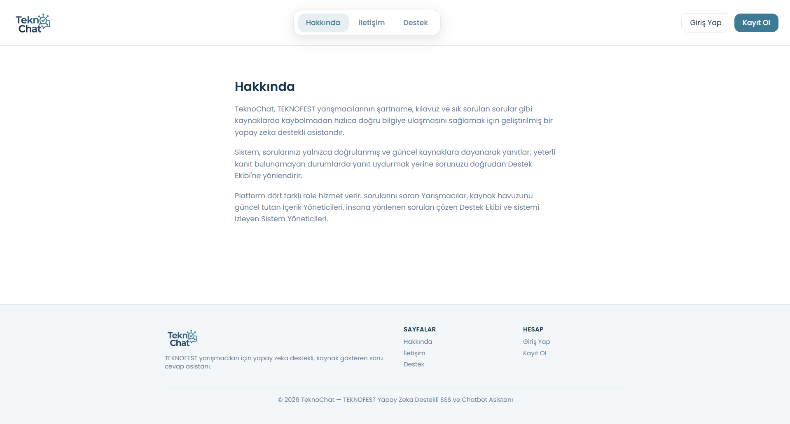 |

| İletişim | Destek Nasıl Çalışır |
|---|---|
| 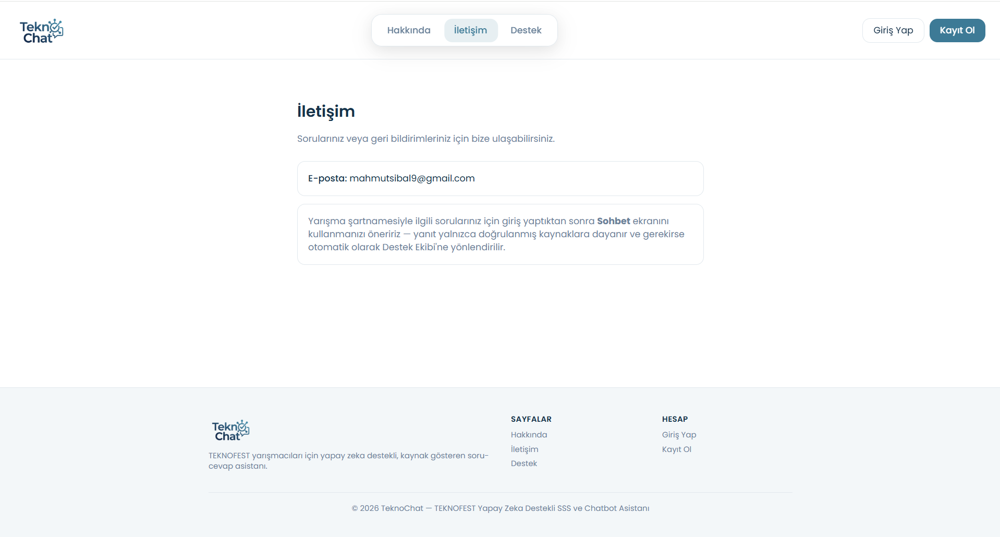 | 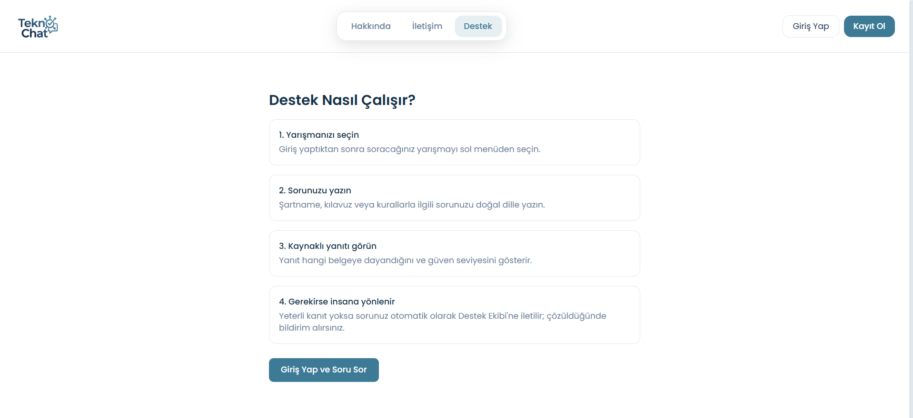 |

| Giriş Yap | Kayıt Ol |
|---|---|
| 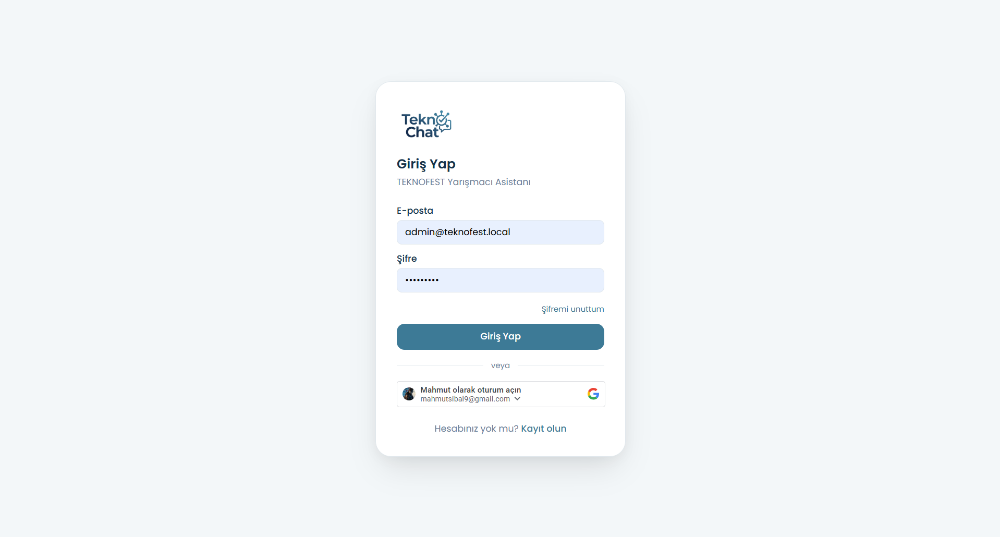 | 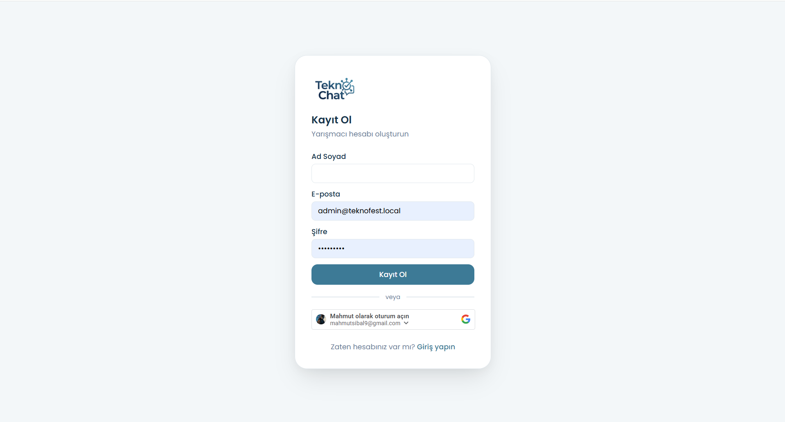 |

### 01 · Yarışmacı

Kaynaklı, güven seviyeli bir yanıt:

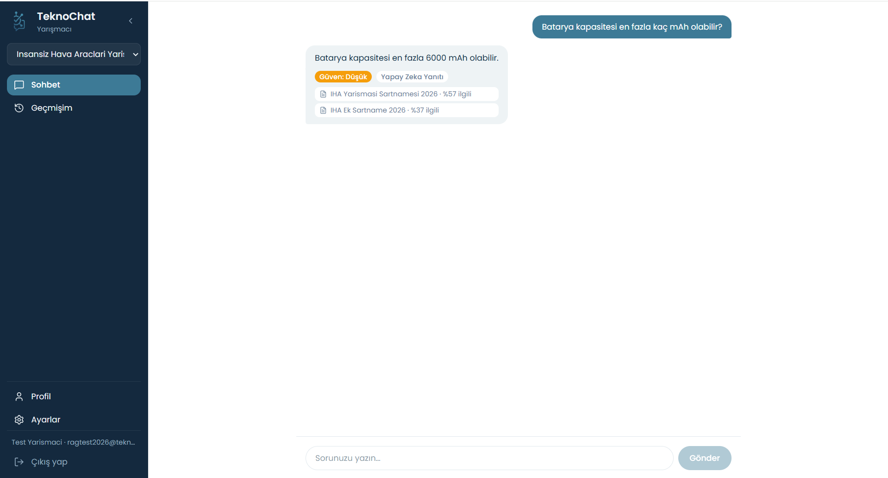

Kanıt yetersiz olduğunda otomatik destek yönlendirmesi:


### 02 · İçerik Yöneticisi

Doküman yükleme ve sürüm/pasif yönetimi:

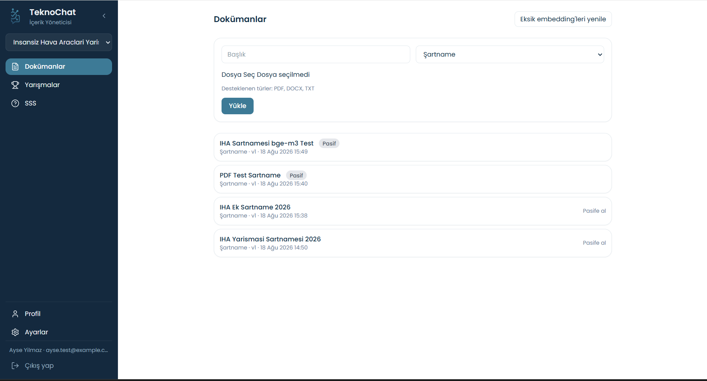

Yarışma ve kategori yönetimi:

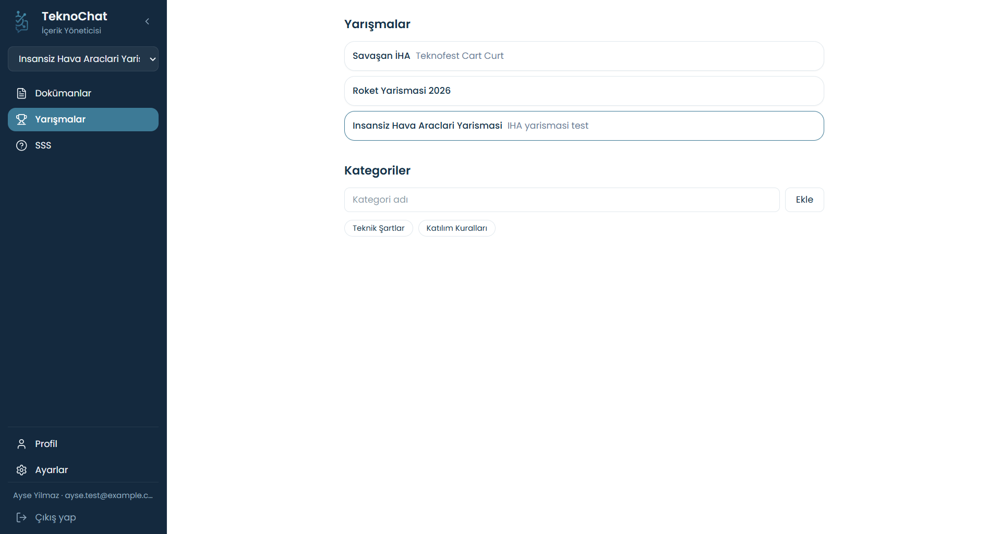

### 03 · Destek Ekibi

Açık destek talepleri ve "SSS'e ekle" seçeneği:

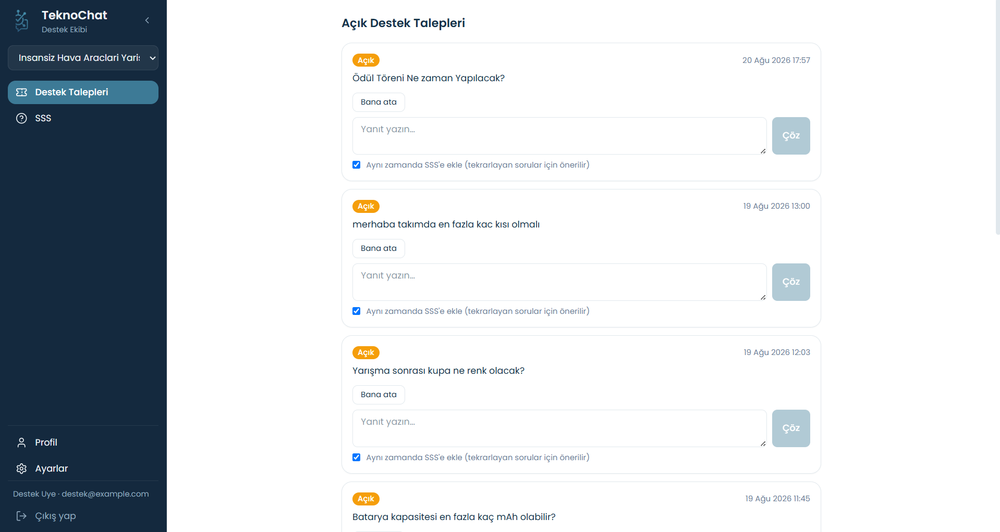

Otomatik SSS havuzu (Destek Ekibi'nin çözdüğü sorulardan üretilir):

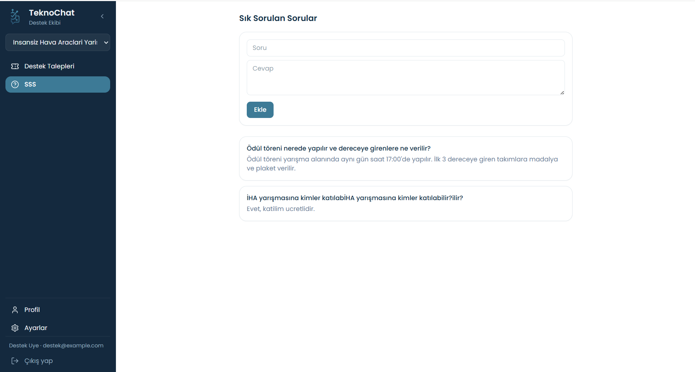

### 04 · Sistem Yöneticisi

Yanıt kalitesi ve yönlendirme oranı analiz paneli:

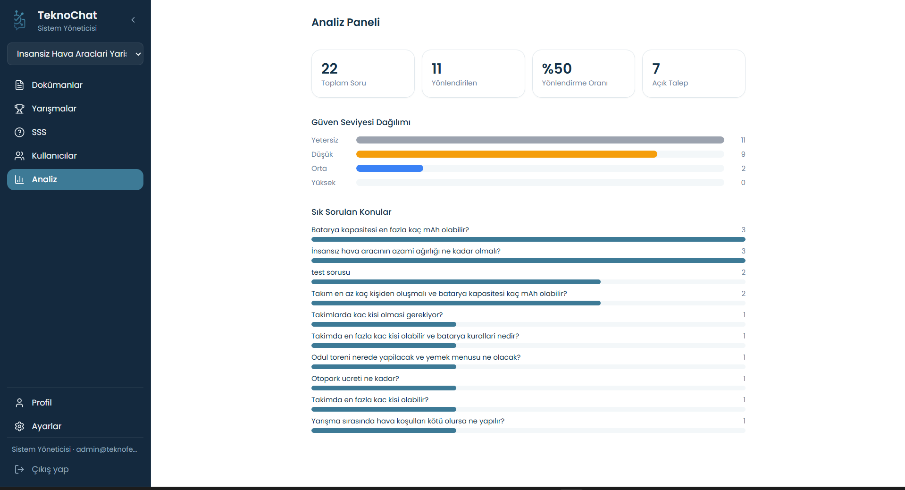

Kullanıcı ve rol yönetimi:

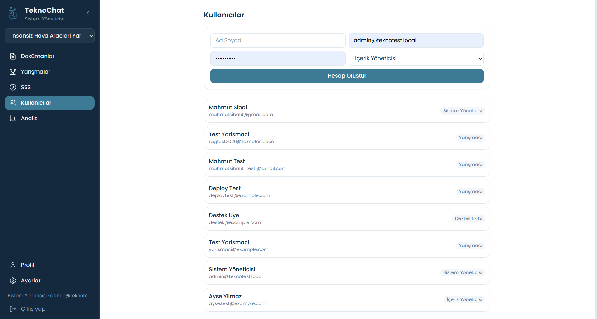

## Mimari

Backend, tek yönlü bağımlılık kuralına uyan dört katmanlı bir Clean Architecture (Onion
Architecture) yapısında:

```
Domain          → Varlıklar (entities), enum'lar, iş kuralı olmayan çekirdek modeller
Application     → Servisler, DTO'lar, arayüzler (kullanım senaryoları)
Infrastructure  → EF Core, Ollama ve Claude istemcileri, sistem durum servisi,
                  e-posta (Brevo), Google/reCAPTCHA doğrulama
API             → Controller'lar, SignalR hub'ı, middleware, kimlik doğrulama
```

Veritabanı şeması (SQL Server, EF Core Code-First):

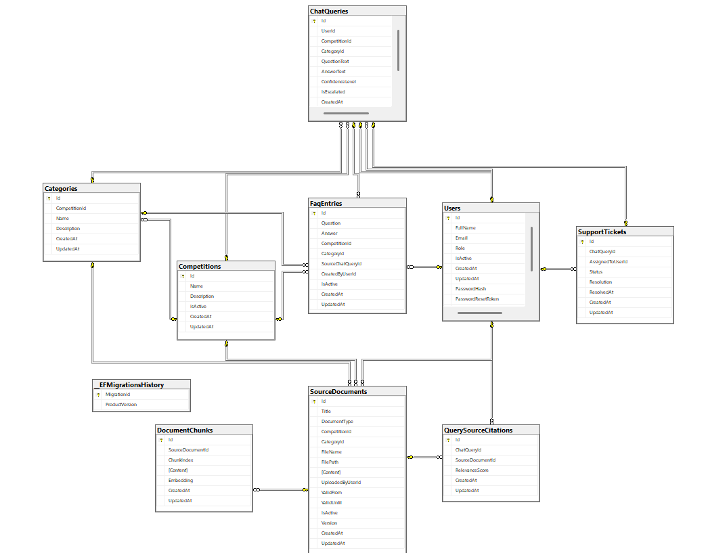

Frontend, rol bazlı korumalı rotalara sahip tek bir React SPA'dır; dört rol de aynı
uygulamayı kullanır, arayüz ve erişilebilir sayfalar role göre değişir.

## Teknoloji Yığını

**Backend**
- .NET 10 / ASP.NET Core Web API
- Entity Framework Core (SQL Server, Code-First migrations)
- JWT Bearer kimlik doğrulama + BCrypt parola hash'leme
- SignalR (canlı yanıt akışı ve bildirimler)
- Ollama (qwen2.5:7b sohbet modeli, bge-m3 embedding modeli) — birincil RAG katmanı
- Anthropic Claude API (claude-haiku-4-5) — Ollama erişilemediğinde devreye giren bulut RAG katmanı
- Google Identity Services (ID token doğrulama) ve Google reCAPTCHA v2
- Brevo (SMTP'siz, API tabanlı e-posta gönderimi)
- Serilog, ASP.NET Core Rate Limiting, Health Checks

**Frontend**
- React 19 + TypeScript + Vite
- React Router v7 (rol bazlı korumalı rotalar)
- Tailwind CSS v4
- @microsoft/signalr (gerçek zamanlı istemci)
- lucide-react (ikonlar)

**Barındırma**
- IIS / Web Deploy (MonsterASP.NET) — backend ve frontend ayrı site olarak
- Cloudflare Tunnel — yerel Ollama sunucusunu güvenli şekilde dışa açmak için

## Güvenlik

- JWT + BCrypt, rol bazlı yetkilendirme (her uç nokta varsayılan olarak kimlik doğrulama ister)
- Giriş/Kayıt formlarında Google reCAPTCHA v2
- Kimlik doğrulama uçlarında IP bazlı rate limiting
- Bilinen yapay zeka botlarına ve otomasyon araçlarına karşı `robots.txt` + User-Agent engelleme (hem IIS/rewrite hem ASP.NET Core middleware seviyesinde)
- `navigator.webdriver` kontrolü ile headless tarayıcı erişiminin engellenmesi
- Güvenlik response header'ları: `Strict-Transport-Security`, `Content-Security-Policy`, `X-Content-Type-Options`, `X-Frame-Options`, `Referrer-Policy`, `Permissions-Policy`
- Sunucu/teknoloji parmak izini gizleyen header temizliği (`Server`, `X-Powered-By` kaldırılır)
- E-posta doğrulama zorunlu kayıt akışı, şifre sıfırlama kod tabanlı ve süreli
- Sırlar (`appsettings.json`, `.env.local`) repoya dahil edilmez — bkz. [Yerel Kurulum](#yerel-kurulum)
- Tüm veritabanı erişimi EF Core'un parametreli LINQ sorgu katmanı üzerinden yapılır (ham/interpolate edilmiş SQL veya `SqlCommand` kullanılmaz) — klasik SQL injection'a karşı yapısal olarak korunur
- Dosya yükleme uç noktası uzantıya değil dosyanın gerçek baytlarına (magic number) bakarak doğrular — yeniden adlandırılmış/sahte dosya türleri PDF/DOCX ayrıştırıcısına ulaşmadan reddedilir — ve istek başına 20 MB boyut sınırı uygular
- Veritabanı bağlantısı TLS ile şifrelenir (`Encrypt=True`)
- Oturum açmış kullanıcı için site genelinde adres çubuğu yalnızca kök adresi gösterir — iç rota yolları tarayıcı geçmişine/adres çubuğuna yazılmaz (e-posta ile açılan şifre sıfırlama ve doğrulama bağlantıları bu davranışın dışındadır, çünkü doğrudan bağlantı olarak çalışmaları gerekir)

## Ekip

TeknoChat, **OmniMind** takımı tarafından T3 Vakfı Yapay Zekâ Creathonu Problem 5
kapsamında geliştirilmiştir. Yazılım geliştirmede **Sümeyye Kartal**, **Mehmet Ali Taş**
ve **Mustafa Ölmez**'in destekleri ile hazırlanmıştır.

## Yerel Kurulum

### Gereksinimler

- .NET 10 SDK
- Node.js 20+
- SQL Server erişimi olan bir bağlantı dizesi
- (Opsiyonel, tam RAG için) [Ollama](https://ollama.com) — `qwen2.5:7b` ve `bge-m3` modelleri

### Backend

```bash
cd src/TeknofestAsistan.API
cp appsettings.json.example appsettings.json
# appsettings.json içindeki ConnectionStrings, Jwt:SecretKey, Recaptcha, Brevo
# ve Google değerlerini kendi bilgilerinizle doldurun.
dotnet ef database update --project ../TeknofestAsistan.Infrastructure --startup-project .
dotnet run
```

### Frontend

```bash
cd frontend
npm install
cp .env .env.local
# .env.local içine VITE_RECAPTCHA_DEV_BYPASS_TOKEN=<appsettings.json'daki DevBypassToken ile aynı değer>
# ekleyin — bu sayede yerel geliştirmede reCAPTCHA çözmeniz gerekmez.
npm run dev
```

> `appsettings.json` ve `.env.local` `.gitignore` içindedir; gerçek sırlar hiçbir zaman
> repoya girmez. Örnek/şablon dosya için `appsettings.json.example`'a bakın.

## Dağıtım (Deployment)

Backend ve frontend, IIS tabanlı MonsterASP.NET barındırmasına Web Deploy (`msdeploy`)
ile ayrı site olarak dağıtılır. Yerel Ollama sunucusu, Cloudflare Quick Tunnel ile
geçici bir genel URL üzerinden backend'e bağlanır; bu URL her tünel yeniden
başlatıldığında değişir ve backend yapılandırmasında güncellenmesi gerekir.

### Sırları Ortam Değişkenleri ile Yönetme (opsiyonel)

ASP.NET Core, `appsettings.json`'daki her değeri aynı ada sahip bir ortam değişkeniyle
otomatik olarak ezer (ek kod gerekmez) — iç içe anahtarlar `__` (çift alt çizgi) ile
ayrılır. Barındırma paneliniz süreç başına ortam değişkeni tanımlamayı destekliyorsa,
en hassas değerleri `appsettings.json` dosyasının kendisine yazmak yerine bu şekilde
verebilirsiniz:

```
ConnectionStrings__DefaultConnection=...
Jwt__SecretKey=...
Claude__ApiKey=...
Recaptcha__SecretKey=...
Recaptcha__DevBypassToken=...
Brevo__ApiKey=...
```

> Not: Paylaşımlı IIS barındırmada ortam değişkenleri genellikle yine `web.config`
> içindeki `<aspNetCore><environmentVariables>` bloğuna yazılır — yani sunucu diskinde
> düz metin olarak durmaya devam ederler, sadece dosya değişir. Gerçek kazanım, barındırma
> sağlayıcınız değişkenleri ayrı, şifreli bir "secrets" panelinde tutuyorsa ortaya çıkar.
> Bu ortamda asıl önemli olan, `appsettings.json`'ın hâlâ `.gitignore` ile repodan hariç
> tutulması ve sunucu dosya izinlerinin dar tutulmasıdır.
