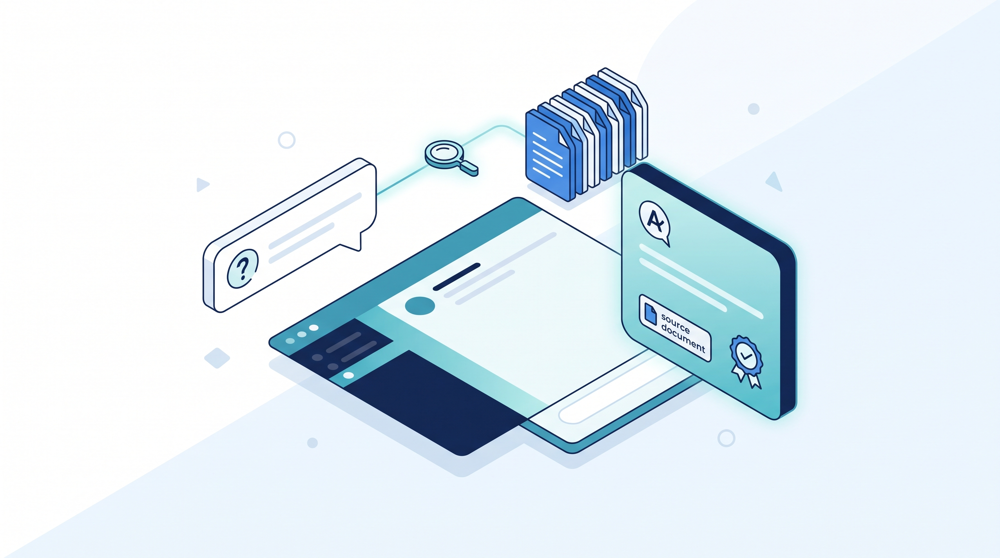
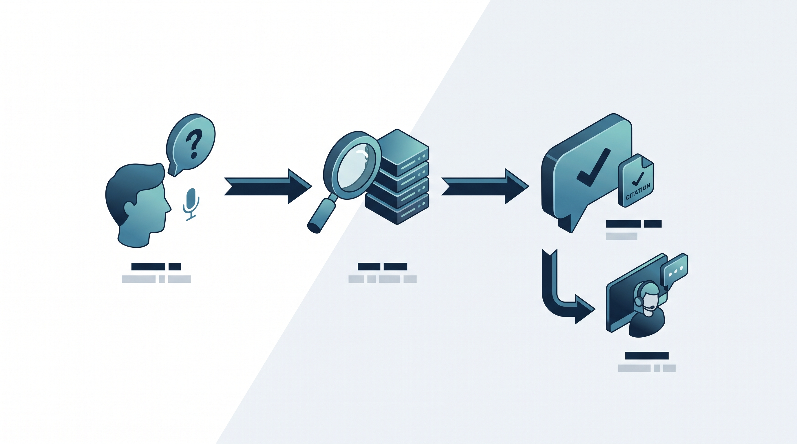
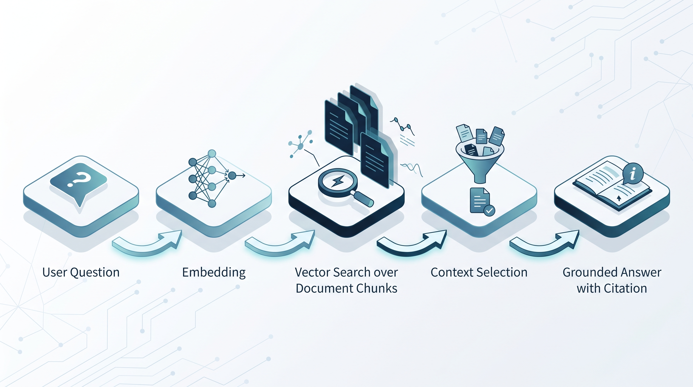
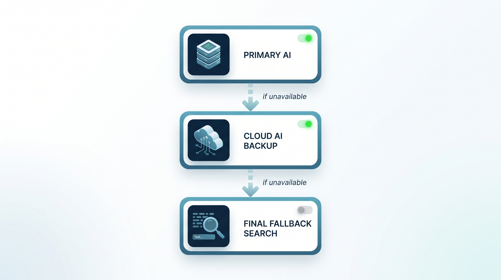
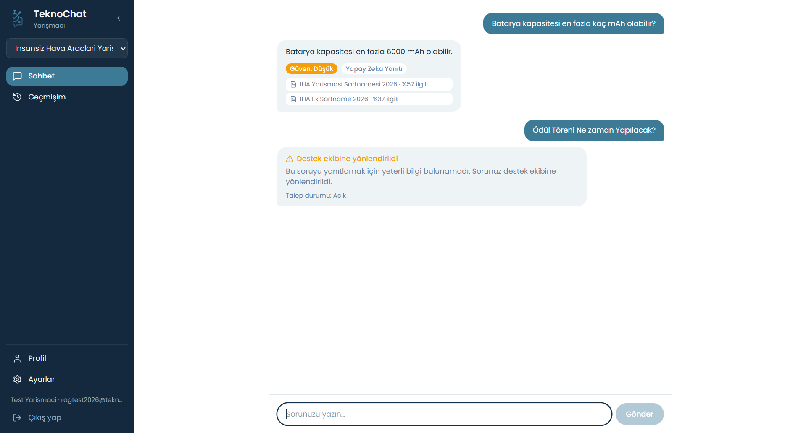
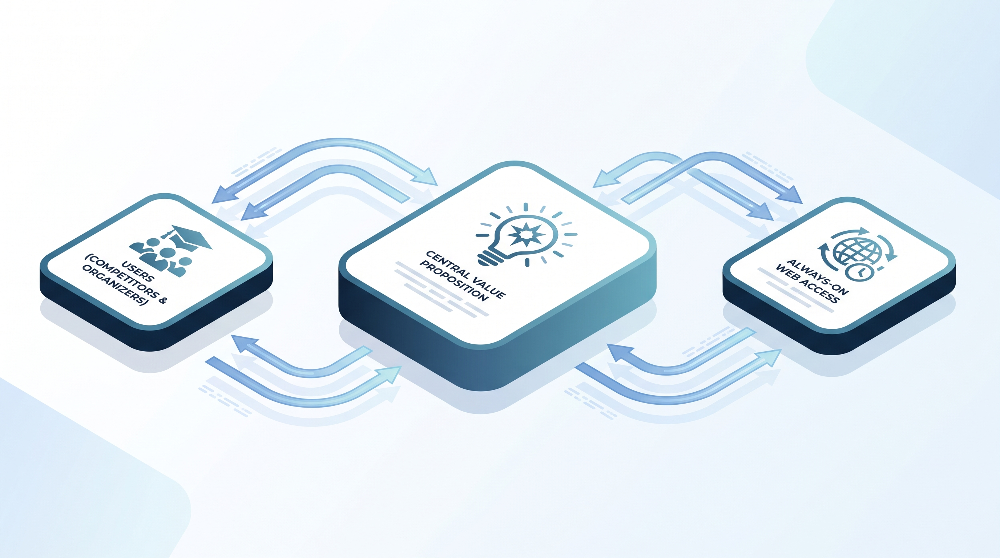
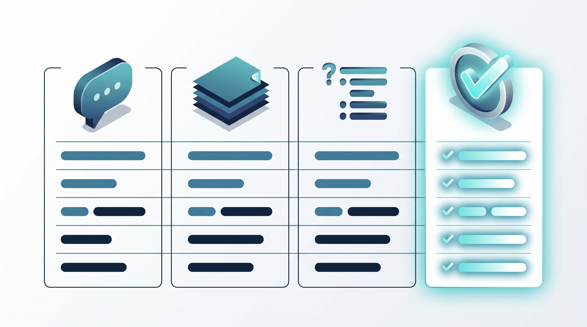
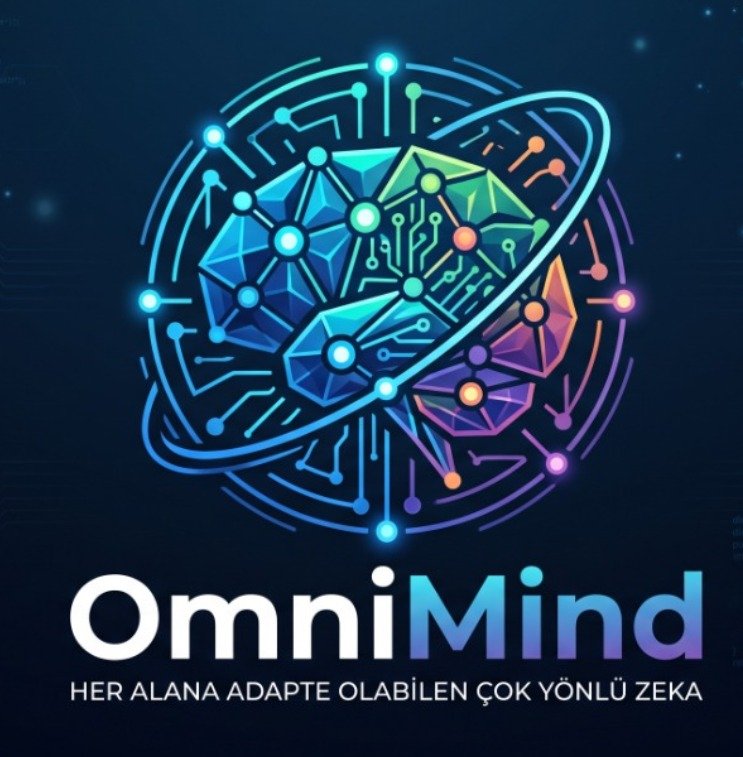

# TeknoChat — Sunum İçeriği

**Program:** T3 Vakfı Bursiyer Yapay Zeka Creathon 2026
**Takım:** OmniMind Team (Takım ID #1003947)
**Başvuru ID:** #5393503
**Başvuru Tarihi:** 13 Ağustos 2026, 22:00
**Takım Üyeleri:** Mehmet Ali Taş, Mahmut Sibal, Sümeyye Kartal, Mustafa Ölmez

---

## Slayt 1 — Kapak

- **Takım adı:** OmniMind Team
- **Başvuru ID:** #5393503
- **Seçilen problem:** Problem 5 — TEKNOFEST yarışmacılarının şartname, kılavuz ve SSS gibi kaynaklarda kaybolmadan, doğrulanmış ve güncel bilgiye hızlı erişebilmesi.

**Proje adı:** TeknoChat — TEKNOFEST Yarışmacı Asistanı

---

## Slayt 2 — Problem / İhtiyaç

TEKNOFEST'e her yıl çok sayıda öğrenci takımı başvuruyor ve her yarışma kategorisi için ayrı ayrı şartname, kılavuz ve SSS dokümanları yayınlanıyor. Biz de bu takımlardan biri olarak aynı sıkıntıyı yaşadık: bir kural veya sınır değeri (örneğin bir aracın azami ağırlığı, başvuru için son tarih, kullanılabilecek motor sınıfı gibi) öğrenmek istediğinizde, çoğu zaman onlarca sayfalık bir PDF'i baştan sona taramak ya da doğru bölümü bulana kadar Ctrl+F ile aramak gerekiyor. Cevap net değilse ya da doküman güncellenmişse, elde kalan tek yol e-posta ya da forum üzerinden destek ekibine ulaşmak oluyor — bu da saatler, bazen günler sürebiliyor.

**Görsel:** 

Bu problem doğrudan **yarışmacı öğrencileri** etkiliyor, ama yükü asıl taşıyan taraf genelde **içerik yöneticileri ve destek ekipleri** oluyor: aynı sorular tekrar tekrar farklı kişilerden geliyor, cevap manuel olarak yazılıyor ve bu süreç ölçeklenmiyor. Bir yarışma kategorisinde yüzlerce katılımcı olduğunu düşünürsek, birebir destek modeli sürdürülebilir değil.

Şu an bu ihtiyaç ya hiç karşılanmıyor (katılımcı dokümanı kendi başına arıyor), ya statik bir SSS sayfasıyla kısmen karşılanıyor (güncel tutulması zor, yarışmaya özel değil) ya da genel amaçlı bir yapay zeka sohbet botuna (ChatGPT vb.) soruluyor — ki bu da güncel olmayan ya da tamamen uydurma cevaplar verebiliyor, çünkü elinde o yarışmanın gerçek, güncel dokümanı yok.

---

## Slayt 3 — Çözüm

**Tek cümlede:** TeknoChat, yarışmacının sorusunu yalnızca o yarışmaya ait doğrulanmış kaynaklara bakarak yanıtlayan, her yanıtın hangi belgeye dayandığını gösteren ve kanıt yetersizse cevap uydurmak yerine insana yönlendiren bir yapay zeka asistanı.

**Görsel:** 

**Temel bileşenler:**
- RAG (Retrieval-Augmented Generation) tabanlı doğal dil soru-cevap
- Her yanıtta kaynak gösterimi ve güven seviyesi (Yetersiz / Düşük / Orta / Yüksek)
- Kanıt yetersizse otomatik destek talebi oluşturma
- Yarışma ve kategoriye göre bağlamlı arama
- Ollama → Claude bulut → anahtar kelime arama şeklinde 3 katmanlı yapay zeka yedekleme, tek bir servis çökse bile sistem durmuyor

Kullanıcıya sunulan somut fayda basit: soru sorduktan saniyeler sonra, hangi dokümana dayandığı belli olan bir cevap alıyor. Cevaba güvenip güvenmeyeceğini de bilebiliyor, çünkü sistem güven seviyesini saklamıyor. Cevap yoksa da boşlukta kalmıyor, otomatik olarak destek ekibine düşüyor.

---

## Slayt 4 — Hedef Kullanıcı / Kullanım Senaryosu

**Birincil hedef kullanıcı:** TEKNOFEST'e katılan yarışmacı öğrenciler (lise ve üniversite düzeyinde, İHA, roket, savaşan İHA gibi teknik kategorilerdeki takım üyeleri).

**Görsel:** 

**Tipik akış:**
1. Yarışmacı giriş yapar, katıldığı yarışmayı (isterse kategoriyi) seçer.
2. Aklındaki soruyu kendi cümleleriyle yazar — örneğin "roketin azami ağırlığı ne kadar olabilir?"
3. Sistem, o yarışmaya ait aktif kaynaklarda anlamsal arama yapar ve en alakalı parçaları bulur.
4. Yanıt, kaynağı ve güven seviyesiyle birlikte ekrana canlı olarak akar (SignalR üzerinden).
5. Kanıt yetersizse, yanıt uydurmak yerine soru otomatik olarak destek ekibine yönlendirilir ve yarışmacı bilgilendirilir.

Kullanıcı sistemle sade bir sohbet ekranı üzerinden etkileşime giriyor; teknik bir öğrenme eğrisi yok, herhangi bir mesajlaşma uygulamasını kullanır gibi soru soruyor.

---

## Slayt 5 — Çözümün Çalışma Yapısı

Backend, Domain / Application / Infrastructure / API olmak üzere dört katmanlı bir Clean Architecture (Onion Architecture) yapısında kurulu; frontend ise rol bazlı korumalı rotalara sahip tek bir React SPA.

**Görsel:** 

**Girdi → İşleme → Çıktı akışı:**
1. **Girdi:** Kullanıcının doğal dilde yazdığı soru
2. **Embedding:** Soru, bge-m3 modeliyle vektöre dönüştürülür
3. **Vektör arama:** Yarışmaya/kategoriye ait kaynak parçaları arasında en alakalı olanlar bulunur
4. **Bağlam seçimi ve güven skoru:** Bulunan parçaların yeterliliği değerlendirilir
5. **Yanıt üretimi:** Yeterli kanıt varsa dil modeli parçalara dayanarak yanıt üretir; yoksa yönlendirme tetiklenir
6. **Çıktı:** Kaynağı ve güven seviyesi belirtilmiş, kullanıcıya canlı akan bir yanıt

**Kullanılan teknoloji bileşenleri:** .NET 8/10 Web API, Entity Framework Core + SQL Server, SignalR (canlı yanıt akışı), Ollama (yerel model sunucusu), Anthropic Claude API, React + TypeScript + Vite, Tailwind CSS.

---

## Slayt 6 — Yapay Zekâ Kullanımı

**Kullanılan modeller ve API'ler:**
- **qwen2.5:7b** — yerel Ollama sunucusu üzerinde çalışan, yanıt üretiminde kullanılan birincil dil modeli
- **bge-m3** — soru ve kaynak parçalarını vektöre dönüştüren embedding modeli
- **Claude API (claude-haiku-4-5)** — Ollama'ya erişilemediğinde devreye giren bulut tabanlı ikinci yanıt katmanı
- **Claude Code** — projenin geliştirme sürecinde kod yazımı, güvenlik sertleştirmesi (rate limiting, güvenlik header'ları, dosya doğrulama), refactoring ve dokümantasyon için aktif olarak kullanıldı

**Görsel:** 

Yapay zeka bu projede iki farklı yerde devreye giriyor: hem **üründe bir özellik** olarak (RAG tabanlı yanıt üretimi ve anlamsal arama, ürünün kendisi bu olmadan var olamaz), hem de **geliştirme sürecinde bir araç** olarak (kod, güvenlik incelemesi ve dokümantasyon büyük ölçüde yapay zeka destekli yazıldı).

Yapay zeka olmadan bu çözüm mümkün olmazdı, çünkü sorunun özü doğal dilde serbestçe sorulan bir soruyu anlayıp doğru kaynak parçasını bulmak ve o parçaya sadık kalarak akıcı bir cevap üretmek. Bunu embedding tabanlı anlamsal arama ve bir dil modeli olmadan yapmanın tek yolu anahtar kelime eşleştirmesi — ki sistemin üçüncü (son çare) katmanı tam olarak bu, ve bilerek en zayıf halka olarak tasarlandı; asıl değeri yapay zeka katmanları taşıyor. Geliştirme tarafında da, dört kişilik küçük bir öğrenci ekibinin bu kapsamda bir sistemi (üç katmanlı RAG mimarisi, güvenlik sertleştirmesi, rol bazlı dört panel) kısa sürede hayata geçirebilmesi büyük ölçüde yapay zeka destekli geliştirme sayesinde oldu.

---

## Slayt 7 — Mevcut Prototip / Ürün Durumu

**Şu an çalışan kısım:** TeknoChat, canlıda çalışan, gerçek bir web adresinden ([teknochat.tryasp.net](https://teknochat.tryasp.net)) erişilebilen tam işlevsel bir uygulama. Dört rol (Yarışmacı, İçerik Yöneticisi, Destek Ekibi, Sistem Yöneticisi) için ayrı panel; gerçek zamanlı sohbet, doküman yükleme (PDF/DOCX/TXT), destek talebi akışı ve analiz paneli çalışır durumda.

**Görsel:** 

**Tamamlanma seviyesi (dürüst özet):** Problem 5'in altı zorunlu MVP gereksinimi tamamlandı ve sistem gerçek kullanıcı testine açık durumda. Eksik/olgunlaşmamış tarafları da var: mobil native bir uygulama yok (şu an sadece responsive web); çoklu dil desteği yok, sistem yalnızca Türkçe çalışıyor; yapay zeka yanıt kalitesi henüz gerçek TEKNOFEST şartnameleriyle geniş çaplı test edilmedi, şu an test amaçlı eklenmiş örnek yarışma verileriyle çalışıyor.

---

## Slayt 8 — İş Modeli

**Değer önerisi (tek cümle):** TEKNOFEST katılımcılarına saniyeler içinde doğru ve kaynaklı bilgi, organizasyon ve destek ekiplerine ise tekrarlayan soru yükünden kurtulma imkânı sunuyoruz.

**Görsel:** 

**Gelir modeli:** Şu aşamada TeknoChat bir öğrenci/hackathon projesi ve henüz bir gelir modeli işletmiyor. Ürünleşme senaryosunda en gerçekçi yol, TEKNOFEST organizasyonuna veya kategorilerin bağlı olduğu kurum/üniversitelere yıllık, yarışma sezonu bazlı bir kurumsal lisans/SaaS aboneliği olarak sunulması.

**İş Modeli Canvas'tan öne çıkan noktalar:**
- **Müşteri segmentleri:** Yarışma organizasyonları (öncelikle TEKNOFEST) ve dolaylı olarak katılımcı öğrenci takımları
- **Değer önerisi:** Doğrulanmış kaynak + kanıt yetersizse insana yönlendirme garantisi — genel amaçlı chatbotların veremediği bir güvence
- **Kanallar:** Doğrudan web platformu; ileride organizasyonun kendi sitesine gömülebilecek bir widget/API entegrasyonu

---

## Slayt 9 — Rakipler / Alternatif Çözümler

**Mevcut alternatifler:** Genel amaçlı yapay zeka sohbet botları (ChatGPT, Gemini vb.), statik SSS sayfaları ve PDF dokümanlar, e-posta/forum üzerinden manuel destek.

**Görsel:** 

**Bizi ayıran fark:** Genel amaçlı chatbotlar o yarışmanın güncel, gerçek dokümanına erişemiyor; bildiğini varsayıp cevap uyduruyor (halüsinasyon). Statik SSS ve PDF'ler günceli yakalayamıyor ve arama kullanıcıya kalıyor. Manuel destek ise ölçeklenmiyor. TeknoChat, yalnızca o yarışmaya yüklenmiş doğrulanmış kaynaklardan cevap veriyor, her yanıtı kaynağıyla gösteriyor ve kanıt yetersizse cevap uydurmak yerine gerçek bir insana yönlendiriyor.

**Somut rekabet avantajı:** Kanıt yetersizse sessizce yanlış cevap vermek yerine otomatik insan yönlendirmesi; yarışma/kategori bazlı bağlamlı arama; tek bir yapay zeka servisi çökse bile devrede kalan 3 katmanlı yedekleme mimarisi — yani hizmet hiçbir zaman tamamen durmuyor.

---

## Slayt 10 — Ekip

**Takım adı:** OmniMind Team

**Üyeler:** Mehmet Ali Taş, Mahmut Sibal, Sümeyye Kartal, Mustafa Ölmez

**Görsel:** 

**Görev dağılımı:** Yazılımın geliştirilmesi (backend, frontend, sistem mimarisi ve yapay zeka entegrasyonu) Mahmut Sibal tarafından yürütüldü; Sümeyye Kartal, Mehmet Ali Taş ve Mustafa Ölmez süreç boyunca yazılım geliştirmeye destek verdi. Ekip, TEKNOFEST'e katılan öğrenciler olarak bu problemi bizzat yaşadığımız için Problem 5'i seçti.

*(Kişisel iletişim bilgisi bu belgede paylaşılmamıştır.)*

---

## Slayt 11 — Sonraki Adımlar

**Kısa vadede geliştirilecek özellikler:**
- Gerçek TEKNOFEST şartname ve kılavuzlarıyla geniş kapsamlı test
- Çoklu dil desteği (İngilizce dahil)
- Mobil uyumlu PWA / bildirim desteği
- Kullanıcı geri bildirimine dayalı yanıt kalitesi iyileştirme döngüsü

**Görsel:** 

**Ürünleştirme / büyüme planı:** Öncelik, TEKNOFEST organizasyon ekibiyle bir pilot görüşme yaparak gerçek kategori dokümanlarıyla canlı bir deneme yapmak. Bu başarılı olursa, aynı modelin farklı TEKNOFEST kategorilerine ve zamanla başka öğrenci yarışması/hackathon organizasyonlarına uyarlanması hedefleniyor.

**Gereken kaynak / destek:** Şu an yerel bir bilgisayarda çalışan Ollama sunucusu bir tünel üzerinden dışa açılıyor; kalıcı bir GPU sunucusu bu bağımlılığı ortadan kaldırır. Ayrıca TEKNOFEST organizasyonundan resmi doküman erişimi/işbirliği ve alan uzmanlığı konusunda mentorluk, sistemin gerçek veriyle olgunlaşması için en çok ihtiyaç duyulan destek.

---

## Slayt 12 — Kapanış

*(Serbest tasarım — zorunlu soru yok.)*

Önerilen kapanış mesajı: TeknoChat, TEKNOFEST'e katılan bizim gibi öğrencilerin yaşadığı somut bir sorundan yola çıktı. Amacımız, yarışmacıların doğru bilgiye ulaşmak için değil, asıl işlerine — tasarlamaya, üretmeye ve yarışmaya — zaman ayırabilmesi.

**OmniMind Team**
